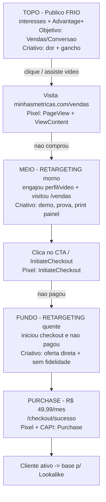

# PLAYBOOK DE CAMPANHA — Meta Ads + Funil de Vendas

**Produto:** Minhas Métricas (minhasmetricas.com) — painel financeiro para donos de pequenas empresas
**Oferta:** Assinatura **R$ 49,99/mês**
**Landing da campanha:** minhasmetricas.com/vendas
**Meta Pixel:** ID `574774374290188` (PageView + InitiateCheckout já disparando)
**Plataforma:** Meta (Instagram + Facebook)
**Verba:** R$ 1.000 a R$ 3.000/mês
**Público-alvo:** donos de PME / MEI / prestadores de serviço, Brasil, 25–55 anos, que trabalham muito e não têm controle financeiro claro.

> Regra de ouro deste playbook: **no começo o objetivo NÃO é lucro imediato, é validar criativo e custo por checkout.** Só depois de achar 1–2 anúncios vencedores é que se escala e se cobra CAC.

---

## 1. FUNIL DE VENDAS COMPLETO

Cada etapa tem um trabalho diferente. Não peça venda pra quem nunca ouviu falar de você, e não fique "educando" quem já clicou em comprar.

### Topo (TOFU) — Descoberta / gerar interesse
- **Objetivo:** apresentar a dor ("você trabalha muito e não sabe se está tendo lucro") e o produto.
- **Público:** frio, por interesses + Advantage+ Audience.
- **Criativo:** vídeo curto ou imagem com dor + gancho. Nada de "assine agora". Foco em parar o scroll.
- **Oferta:** convite pra conhecer / ver como funciona (clique pra /vendas).

### Meio (MOFU) — Consideração / quebra de objeção
- **Objetivo:** quem viu o topo mas não comprou. Mostrar prova, print do painel, depoimento, "em 5 minutos você monta seu painel".
- **Público:** retargeting de quem engajou (vídeo, perfil) ou visitou /vendas sem iniciar checkout.
- **Criativo:** demonstração do produto, print de dashboard, comparação "planilha bagunçada x Minhas Métricas".
- **Oferta:** teste / primeiro mês, garantia, "cancele quando quiser".

### Fundo (BOFU) — Conversão
- **Objetivo:** fechar a venda de quem já demonstrou intenção.
- **Público:** retargeting quente — clicou no CTA e/ou iniciou checkout e não pagou.
- **Criativo:** oferta direta, urgência leve, remoção de risco (sem fidelidade, R$ 49,99/mês, cancela quando quiser).
- **Oferta:** assinar agora, R$ 49,99/mês.

### Diagrama do funil

---

## 2. ESTRUTURA DE CAMPANHAS NO META

Estrutura enxuta e correta pra verba pequena: **1 campanha de aquisição (frio) + 1 campanha de retargeting.** Use CBO (orçamento na campanha) só quando tiver dados; no começo, orçamento no conjunto (ABO) pra controlar cada teste.

### (a) Campanha de VENDAS / Conversão (público FRIO)
- **Objetivo da campanha:** Vendas (conversão).
- **Evento de otimização:** **Purchase** (assim que o Purchase estiver disparando de verdade). Enquanto não houver volume de Purchase, otimize por **InitiateCheckout** — é o evento com dados hoje.
- **Estratégia de lance:** menor custo (automático). Sem CPA-alvo no começo.
- **Posicionamentos:** Advantage+ (automático). Deixe a Meta distribuir Feed/Reels/Stories.

**Conjuntos de anúncios (frio):**
| Conjunto | Segmentação | Observação |
|---|---|---|
| CJ-Frio-Interesses | Interesses de empreendedorismo/gestão (ver seção 3) + Advantage+ Audience LIGADO | Interesses viram "sugestão", a Meta expande |
| CJ-Frio-Advantage+ (aberto) | Só idade 25–55, Brasil, SEM interesses (Advantage+ Audience total) | Deixa o algoritmo achar o comprador — costuma ganhar com bom criativo |

> Com R$ 1.000/mês, rode **1 conjunto frio** (o de interesses) pra não pulverizar. Com R$ 2k–3k, rode os dois.

### (b) Campanha de RETARGETING (usando o Pixel)
- **Objetivo:** Vendas (conversão), otimizando por InitiateCheckout/Purchase.
- **Público:** custom audiences do Pixel (seção 3), com **exclusão de quem já comprou**.

**Conjuntos de anúncios (retargeting), do mais quente pro mais morno:**
| Conjunto | Público | Janela | Criativo |
|---|---|---|---|
| RTG-Checkout | Iniciou checkout e NÃO comprou | 14 dias | Oferta direta, sem fidelidade |
| RTG-CTA-Visitou | Visitou /vendas ou clicou no CTA, sem checkout | 30 dias | Prova + demo do painel |
| RTG-Engajamento | Engajou com perfil IG/FB ou assistiu vídeo | 60–90 dias | Reforço da dor + convite |

Excluir sempre: **compradores (Purchase 180d)** de todos os conjuntos.

### DIVISÃO DE VERBA (≈70% frio / 30% retargeting)

Retargeting satura rápido (público pequeno). Se a base ainda é pequena, comece **80/20** e migre pra 70/30 conforme o tráfego cresce.

| Verba/mês | Frio (≈70%) | Retargeting (≈30%) | Frio/dia | Retarget/dia |
|---|---|---|---|---|
| **R$ 1.000** | R$ 700 | R$ 300 | ~R$ 23/dia | ~R$ 10/dia |
| **R$ 2.000** | R$ 1.400 | R$ 600 | ~R$ 47/dia | ~R$ 20/dia |
| **R$ 3.000** | R$ 2.100 | R$ 900 | ~R$ 70/dia | ~R$ 30/dia |

> Com R$ 1.000: coloque quase tudo no frio nas 2 primeiras semanas (ainda não há base pra retargetar). Ligue o retargeting forte só depois que /vendas acumular tráfego.

---

## 3. PÚBLICOS

### Interesses sugeridos (público frio)
Agrupe por temas e teste em conjuntos separados só quando houver verba. Sugestões:

- **Empreendedorismo:** Empreendedorismo, Pequenas empresas, Empreendedor, Startup, Negócio próprio.
- **Gestão financeira:** Gestão financeira, Finanças, Fluxo de caixa, Educação financeira, Planejamento financeiro.
- **Instituições/educação de negócio:** Sebrae, Endeavor, Cursos de gestão, MEI (Microempreendedor Individual).
- **Contabilidade:** Contabilidade, Contador, Nota fiscal, Imposto de renda.
- **Concorrentes / softwares (interesse por categoria):** Conta Azul, QuickBooks, Granatum, Nibo, contas a pagar e receber, ERP, sistema de gestão.
- **Perfil profissional:** donos de restaurante, salão de beleza, loja, prestadores de serviço, autônomos (segmentar por cargo "proprietário/dono" quando disponível).

> Dica: com Advantage+ Audience ligado, interesses são só "pista". Não empilhe 20 interesses — 5 a 8 bem escolhidos bastam.

### Lookalike (quando houver dados)
Só crie quando a fonte tiver **volume mínimo (~100+ registros, idealmente 1.000)**.
- **LLA 1% — Compradores (Purchase)** → o mais valioso; criar assim que houver compradores suficientes.
- **LLA 1% — Iniciou checkout** → boa ponte enquanto Purchase não tem volume.
- **LLA 1–3% — Visitantes de /vendas** → alcance maior, começo do funil.
Teste LLA como conjunto frio adicional, competindo com o de interesses.

### Custom Audiences de retargeting a criar (no Gerenciador de Públicos)
1. **Visitou /vendas** — tráfego do site, URL contém `/vendas`, 30 e 60 dias.
2. **Iniciou checkout (InitiateCheckout)** — evento do Pixel, 14 e 30 dias.
3. **Compradores (Purchase)** — 180 dias → usar SÓ para **excluir** (e depois virar semente de Lookalike).
4. **Engajou com o perfil Instagram** — 90 dias.
5. **Engajou com a página Facebook** — 90 dias.
6. **Assistiu vídeo (25%/50%/75%)** — 60 dias, para quem usa criativo em vídeo.

---

## 4. PIXEL / EVENTOS

Pixel ID `574774374290188`. Estado atual e o que falta:

| Evento | Quando dispara | Status | Ação |
|---|---|---|---|
| **PageView** | Toda visita | OK | Manter |
| **ViewContent** | Chegou na /vendas e viu a oferta (ou rolou X%) | **A configurar** | Disparar no load da /vendas (ou ao ver o bloco de preço) — melhora públicos de MOFU |
| **InitiateCheckout** | Clique no botão de checkout | OK | Manter; enviar `value: 49.99` e `currency: BRL` |
| **Purchase** | Pagamento aprovado | **A configurar** | Disparar em **/checkout/sucesso** E via **CAPI** com `value: 49.99`, `currency: BRL` |

### Como configurar o Purchase (quando o pagamento estiver integrado)
1. **Pixel no browser:** disparar `Purchase` na página **/checkout/sucesso** (após retorno aprovado do gateway), com `value` e `currency`.
2. **Conversions API (CAPI):** disparar `Purchase` do **servidor** (webhook do gateway → endpoint seu → API da Meta), enviando também dados do cliente com hash (e-mail, telefone) e o **mesmo `event_id`** do Pixel para **deduplicação**.
3. **Deduplicação:** use o mesmo `event_id` no Pixel e na CAPI pra Meta não contar 2x.

### Por que a CAPI melhora os resultados
- **Menos perda por bloqueio:** iOS/ATT, bloqueadores de anúncio e cookies de terceiros fazem o Pixel do navegador perder eventos. O servidor não sofre isso.
- **Purchase confiável = otimização melhor:** o algoritmo aprende com quem realmente comprou; sem CAPI, ele otimiza com dados furados.
- **Matching melhor:** e-mail/telefone com hash aumentam a taxa de correspondência e recuperam conversões atribuídas.
- **Fonte da verdade no pagamento:** o webhook do gateway confirma pagamento aprovado — não conta clique que abandonou.
- Resultado prático: **CPA mais baixo e reportado corretamente**, retargeting e Lookalike mais precisos.

---

## 5. COPY DOS ANÚNCIOS

Tom: direto, sem jargão, falando com o dono cansado de planilha. Foco em dor → solução → CTA.

### Texto principal (Primary text) — 5 variações

**V1 — Dor do lucro invisível**
Você trabalha o mês inteiro, o dinheiro entra e sai... mas no fim você não sabe se sobrou lucro ou não?
Isso não é falta de trabalho. É falta de controle.
O Minhas Métricas junta entradas, saídas e lucro num painel simples, sem planilha complicada.
Em 5 minutos você enxerga a saúde do seu negócio.
👉 Assine por R$ 49,99/mês e pare de trabalhar no escuro.

**V2 — Contra a planilha**
Sua gestão financeira ainda mora numa planilha que você tem preguiça de abrir?
Enquanto isso, você não sabe quanto pode retirar sem quebrar o caixa.
O Minhas Métricas mostra fluxo de caixa, contas a pagar e lucro real, tudo num lugar.
Feito pra dono de pequena empresa, não pra contador.
👉 Comece hoje por R$ 49,99/mês. Cancele quando quiser.

**V3 — MEI / prestador de serviço**
MEI e prestador de serviço: o cliente pagou, mas o dinheiro sumiu no fim do mês?
O problema quase nunca é vender pouco. É não saber pra onde vai o que entra.
Com o Minhas Métricas você acompanha cada real e sabe exatamente quanto sobra.
Painel pronto, sem precisar entender de finanças.
👉 R$ 49,99/mês. Teste sem fidelidade.

**V4 — Tempo / cansaço**
Você abriu o negócio pra ter liberdade e hoje vive apagando incêndio no caixa?
Passar horas somando conta no caderno ou na planilha não devolve seu tempo.
O Minhas Métricas automatiza o controle financeiro e te mostra o que importa em segundos.
Menos achismo, mais decisão.
👉 Assine por R$ 49,99/mês e tenha clareza a partir de hoje.

**V5 — Decisão com número**
"Será que posso contratar? Comprar estoque? Tirar um pró-labore maior?"
Sem número claro, toda decisão vira aposta.
O Minhas Métricas transforma suas entradas e saídas em um painel que responde essas perguntas.
Simples, no celular, feito pra quem toca o negócio sozinho.
👉 R$ 49,99/mês. Comece agora.

### Títulos curtos (Headline) — 5
1. Saiba se seu negócio dá lucro de verdade
2. Controle financeiro sem planilha
3. Seu painel financeiro em 5 minutos
4. Pare de trabalhar no escuro
5. R$ 49,99/mês. Cancele quando quiser.

### Descrições (Description) — 3
1. Fluxo de caixa, contas e lucro num só lugar.
2. Feito pra dono de pequena empresa e MEI.
3. Sem fidelidade. Comece hoje.

---

## 6. METAS / KPIs (SaaS low-ticket no BR)

Faixas de referência para Brasil, público de negócios (varia por criativo e nicho). Use como termômetro, não como lei.

| Métrica | Faixa esperada | Leitura |
|---|---|---|
| **CPM** | R$ 15 – R$ 45 | Público de negócios costuma ser mais caro |
| **CTR (link)** | 1,0% – 2,5% | Abaixo de 0,8%: criativo fraco |
| **CPC (link)** | R$ 0,80 – R$ 2,50 | Acima de R$ 3: revisar segmentação/criativo |
| **Custo por InitiateCheckout** | R$ 8 – R$ 25 | KPI principal na fase de validação |
| **Taxa Checkout → Compra** | 15% – 35% | Depende da landing e do pagamento |
| **CPA / CAC alvo** | **R$ 40 – R$ 90** por assinante | Ver conta de payback abaixo |

### Conta de payback / LTV (ticket R$ 49,99/mês)
LTV = ticket mensal × meses médios de permanência (margem ~100% em software; ignore custo de infra por simplicidade).

| Permanência média | LTV (R$ 49,99 × N) |
|---|---|
| 3 meses | R$ 149,97 |
| 6 meses | R$ 299,94 |
| 12 meses | R$ 599,88 |
| 18 meses | R$ 899,82 |

**Payback (quantos meses pra pagar o CAC):**
- CAC R$ 50 → paga em **~1 mês** (1 mensalidade já cobre). Excelente.
- CAC R$ 90 → paga em **~2 meses**. Saudável.
- CAC R$ 150 → paga em ~3 meses; só vale se a retenção for boa (6+ meses).

**Regra prática de saúde:** LTV/CAC ≥ 3.
- Com permanência de 6 meses (LTV R$ 300), CAC até **R$ 100** mantém LTV/CAC = 3.
- Com permanência de 12 meses (LTV R$ 600), dá pra pagar até **R$ 200** de CAC e ainda ficar em 3x.

> **Foco da largada:** não persiga CAC no dia 1. Primeiro ache criativo com **CTR ≥ 1,5%** e **custo por InitiateCheckout ≤ R$ 20**. Com isso resolvido, o Purchase e o CAC caem sozinhos quando o retargeting e a CAPI entram.

---

## 7. CRONOGRAMA DE TESTE (Semana 1 a 4)

Regra transversal: **decida com número, não com achismo.** Só corte/escale com dados suficientes (≥ 1.000 impressões OU ~R$ 30–50 gastos no anúncio).

### Semana 1 — Subir e coletar
- Rodar **1 campanha fria** com **1 conjunto** (interesses) e **3 a 4 criativos** diferentes (ângulos: lucro invisível, anti-planilha, MEI, tempo).
- Otimizar por **InitiateCheckout** (Purchase ainda sem volume).
- **NÃO mexer** nos primeiros 3–4 dias (fase de aprendizado). Nada de desligar no dia 1.

### Semana 2 — Primeiro corte
- **Cortar criativo** com CTR < 0,8% E custo por checkout muito acima da média após ~R$ 40–50 gastos.
- Manter os 1–2 melhores. Subir **2 criativos novos** inspirados no vencedor (mesmo ângulo, novo gancho).
- Ligar **retargeting** se /vendas já acumulou tráfego (público ≥ ~300 pessoas).

### Semana 3 — Refinar e testar público
- Adicionar **2º conjunto frio**: Advantage+ aberto (sem interesses) OU Lookalike se já houver base.
- Duplicar o criativo vencedor no novo público. Comparar custo por checkout.
- Retargeting rodando os 3 conjuntos (checkout / visitou / engajou).

### Semana 4 — Escalar o que funciona
- **Escalar** conjunto/criativo vencedor aumentando orçamento **20–30% a cada 2–3 dias** (subida brusca reseta aprendizado).
- Pausar tudo que ficou com custo por checkout acima do teto (> R$ 25) sem sinal de melhora.
- Se Purchase já tem volume (~15–30/semana), **trocar a otimização de InitiateCheckout para Purchase**.

### Regras rápidas de corte e escala
| Situação | Ação |
|---|---|
| CTR < 0,8% após R$ 40 gastos | Cortar criativo |
| Custo/checkout > 2× a média do conjunto | Cortar |
| Anúncio com melhor custo/checkout por 3+ dias | Escalar +20–30% a cada 2–3 dias |
| Conjunto saindo do aprendizado (~50 eventos/sem) | Manter e observar |
| Frequência de retargeting > 3–4 | Renovar criativo (fadiga) |

---

## 8. CHECKLIST DE LANÇAMENTO

Antes de apertar "Publicar", confirme tudo:

**Rastreamento / Pixel**
- [ ] Pixel `574774374290188` ativo e recebendo PageView + InitiateCheckout (testar no Gerenciador de Eventos / Meta Pixel Helper)
- [ ] Evento **ViewContent** disparando na /vendas
- [ ] Evento **Purchase** configurado em /checkout/sucesso (quando pagamento integrado)
- [ ] **CAPI (Conversions API)** enviando Purchase do servidor com deduplicação (`event_id`)
- [ ] `value: 49.99` e `currency: BRL` nos eventos de valor

**Negócio / conta**
- [ ] **Domínio minhasmetricas.com verificado** no Gerenciador de Negócios da Meta (obrigatório para configurar eventos e Aggregated Event Measurement)
- [ ] **Configuração de eventos agregados** (AEM) definida, com Purchase como evento prioritário
- [ ] Conta de anúncios criada + **forma de pagamento ativa** e sem pendência
- [ ] Página do Facebook + conta do Instagram vinculadas ao Business Manager
- [ ] Fuso, moeda (BRL) e limite de gasto da conta conferidos

**Landing / conversão**
- [ ] /vendas carregando rápido no celular (maior parte do tráfego é mobile)
- [ ] CTA claro e botão de checkout funcionando
- [ ] **Meios de pagamento ativos** (cartão/Pix) e fluxo até /checkout/sucesso testado com compra real
- [ ] Página **/privacidade (LGPD)** publicada e **linkada** na /vendas e no rodapé (exigência da Meta para anúncios)
- [ ] Termos de uso / política de assinatura visíveis (cancelamento, cobrança recorrente)

**Públicos e campanhas**
- [ ] Custom audiences de retargeting criados (visitou /vendas, InitiateCheckout, engajamento)
- [ ] Público de compradores (Purchase 180d) criado para **exclusão**
- [ ] Campanha fria + campanha retargeting montadas com a divisão de verba (seção 2)
- [ ] 3–4 criativos aprovados (dentro das políticas da Meta, sem promessa de resultado financeiro garantido)
- [ ] Orçamento diário e limite mensal definidos conforme a verba (R$ 1k / 2k / 3k)

---

### Resumo operacional rápido
1. Suba a campanha fria com 3–4 criativos, otimizando por InitiateCheckout.
2. Deixe rodar 3–4 dias, corte os fracos, escale os fortes de 20–30%.
3. Ligue retargeting quando houver base; configure Purchase + CAPI o quanto antes.
4. Meta da largada: CTR ≥ 1,5% e custo por checkout ≤ R$ 20. CAC alvo R$ 40–90 (payback ~1–2 meses).
